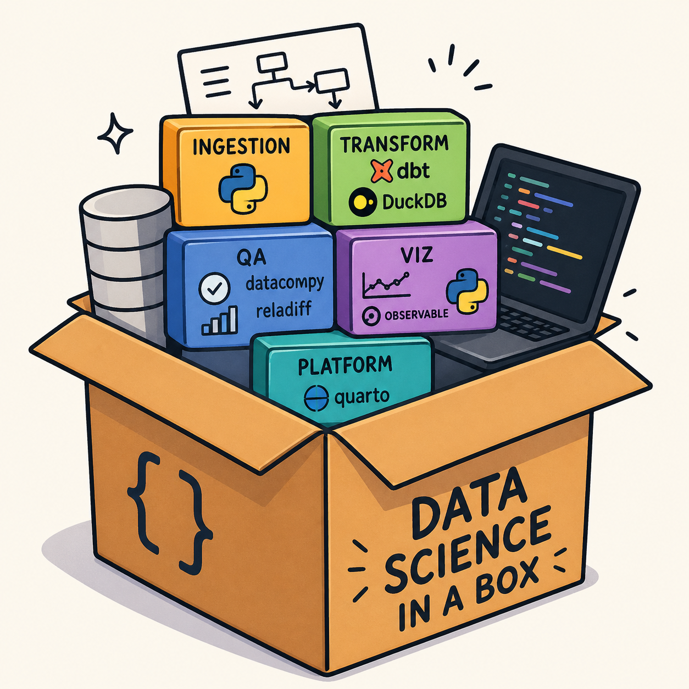
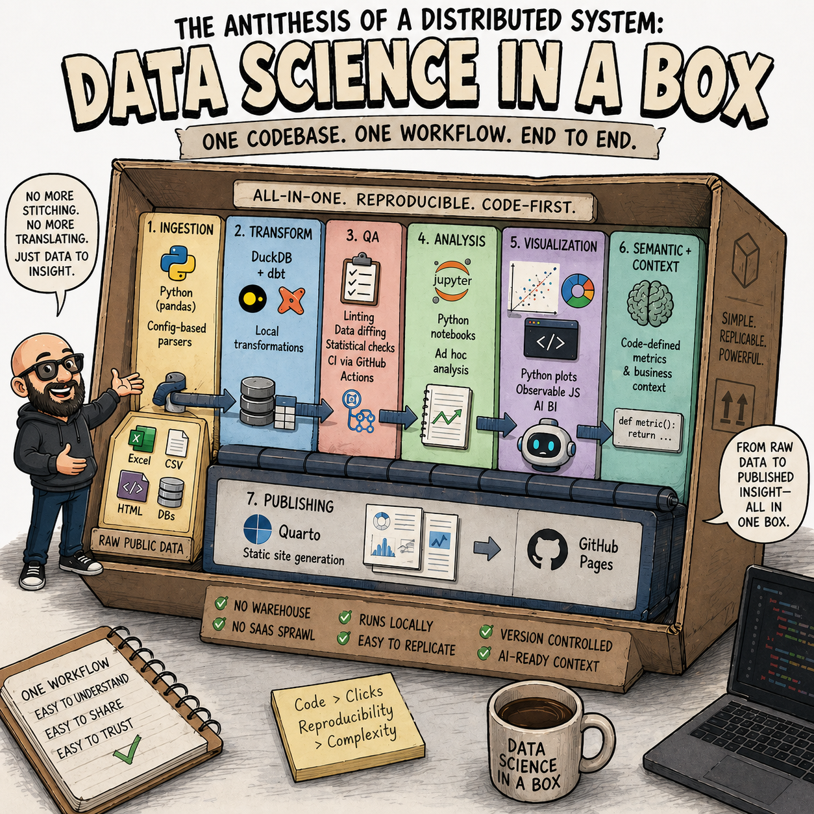
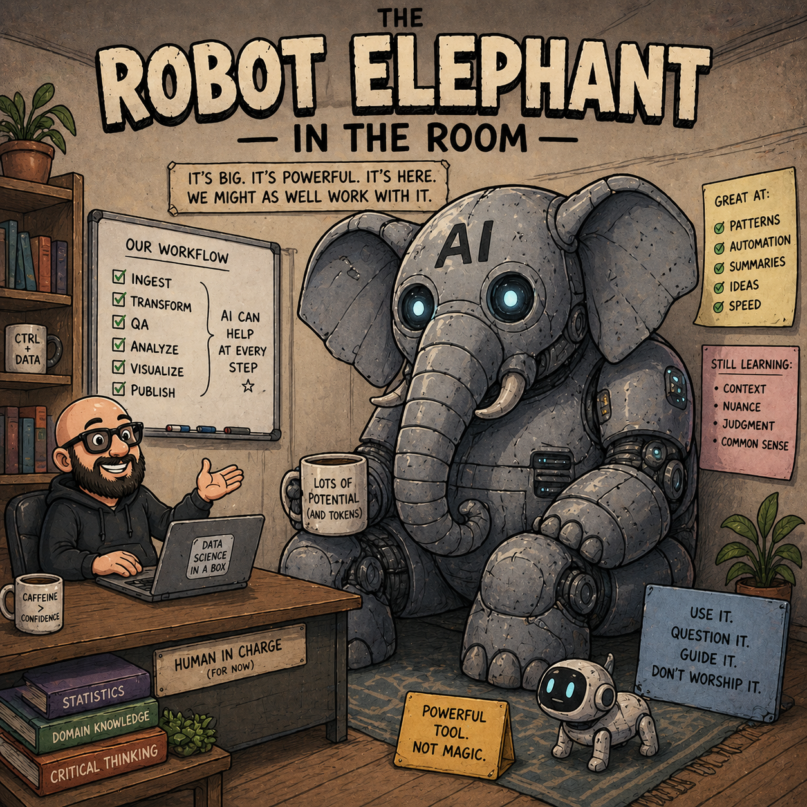

{width=300px fig-align="center"}

> I didn’t set out to put “data science in a box.”

## The Translation Problem

I was trying to build an end-to-end data system that could handle ingestion, transformation, QA, analysis, and publishing. But I kept running into the same problem: I was stitching together different tools, platforms, and codebases that didn’t really feel like they were meant to work together.

At a high level, everything was “best in class.” Or at least familiar.

- Fivetran for ingestion. Some custom Python for the rest.
- dbt running on BigQuery with a data lake in GCS.
- Tableau for dashboards, plus occasional Python notebooks or JavaScript visualizations when things got more specific.
- A Django app sitting on top of everything for publishing and sharing outputs.

It all worked, but it felt like I was assembling a system rather than working inside one.

The thing is, most of the friction wasn’t in any single tool. **It was in the gaps between them.**

Chasing bugs across systems became normal. A transformation would fail, but it wasn’t always obvious whether it was the ingestion layer, a dbt model, or something downstream in deployment. I spent a lot of time trying to answer a simple question: *where did this break?*

There was also this constant code switching that felt more expensive than it should have been. One moment I’m thinking in Python for data wrangling, then I’m in SQL for transformations, then I’m in Tableau trying to reason about a dashboard, then I’m back in web development just to publish results.

It didn’t feel like a coherent system. It felt like a set of interfaces I had to constantly translate between.

Over time, I started to notice I wasn’t really designing data workflows anymore. I was designing integrations between systems that assumed they were independent.

## Thinking Inside the Box

That’s where the idea of “data science in a box” started to take shape.

At its core, it’s a loose attempt to collapse those boundaries into something more monolithic and reproducible.

Not because monoliths are inherently better, but because for the kind of work I’m doing, the overhead of distribution, separation, and orchestration often outweighs the benefits.

What I’ve been building toward looks roughly like this:

```{mermaid}
flowchart TD

%% =====================
%% Nodes
%% =====================

A["📥 Raw Public Data<br/>Excel • CSV • HTML • DBs"] --> B

B["🐍 Python Ingestion<br/>Config-based pandas parser"] --> C

C["🦆 DuckDB + dbt<br/>Local transformations"] --> D
C --> E
C --> G

D["🧪 QA Layer<br/>linting • data diffing<br/>CI via GitHub Actions"]

E["📊 Analysis Layer<br/>Python notebooks / ad hoc"]

F["📈 Visualization Layer<br/>Observable JS • Python plots • AI BI"]

G["🧭 Semantic + Context Layer<br/>Code-defined metrics"]

E --> F
E --> H
F --> H
G --> E

H["📝 Quarto Publishing<br/>Static site generation"] --> I["🌐 GitHub Pages"]

%% =====================
%% Styling
%% =====================

classDef ingest fill:#FFE8A3,stroke:#C9A227,stroke-width:1px,color:#000;
classDef transform fill:#BFE3FF,stroke:#2B6CB0,stroke-width:1px,color:#000;
classDef qa fill:#FFD1DC,stroke:#C53030,stroke-width:1px,color:#000;
classDef analysis fill:#D6FFD6,stroke:#2F855A,stroke-width:1px,color:#000;
classDef viz fill:#E9D8FD,stroke:#6B46C1,stroke-width:1px,color:#000;
classDef semantic fill:#C6F6D5,stroke:#2F855A,stroke-width:1px,color:#000;
classDef publish fill:#E2E8F0,stroke:#4A5568,stroke-width:1px,color:#000;

class B ingest;
class C transform;
class D qa;
class E analysis;
class F viz;
class G semantic;
class H publish;
class I publish;
```

I use Python for ingestion, mostly because the data I deal with is messy and heterogeneous. Public research datasets come in every format you can imagine: Excel files, CSVs, Access databases, scraped HTML, and more. Instead of building separate ingestion systems for each case, I’ve been wrapping common patterns in a [config-based parser layer on top of pandas](/posts/pandas-yaml-config/).

Transformations still use dbt, but now running on [DuckDB](https://duckdb.org/) instead of a cloud warehouse. That change alone removes a large amount of infrastructure complexity. The goal isn’t to scale infinitely, it’s to make the system understandable end-to-end on a single machine.

QA is still evolving. I’ve been experimenting with tools like [datacompy](https://capitalone.github.io/datacompy/) and [reladiff](https://reladiff.readthedocs.io/en/latest/index.html), along with more code-based statistical checks for outlier detection. The idea is to reduce reliance on manual validation and instead embed comparison and validation directly into the workflow. dbt tests still exist, but they’re not the whole story.

Visualization is intentionally flexible, but constrained to code-first outputs. Python plotting, Observable-style JavaScript, and emerging AI-generated BI tools like [Motherduck Dives](https://motherduck.com/docs/key-tasks/ai-and-motherduck/dives/) all fit here. The key requirement is that outputs are reproducible and version-controlled, not trapped in a proprietary interface.

And instead of a traditional web application layer, I’ve been using [Quarto](https://quarto.org/) as the publishing system (the same tool this blog is built on). It lets me render analysis, narrative, and outputs into static pages that can be deployed directly to something like GitHub Pages or any other static site hosting service. No separate backend. No deployment pipeline that needs its own infrastructure.

The thing that ties all of this together is not the tools themselves, but the constraint: everything should live in a single codebase, and everything should be reproducible from that codebase alone.

That includes ingestion, transformation, QA, analysis, and publishing.

The idea is to avoid the feeling of a distributed system when what you actually want is a single coherent workflow.

{width=600px fig-align="center"}

# What It's Not

There’s also a second constraint that matters just as much: this system should be easy to replicate.

Not in theory, but in practice. If I share the codebase with someone, they should be able to run it locally without standing up a warehouse, configuring cloud infrastructure, or wiring together SaaS tools. Install dependencies, run the pipeline, and you get the full system.

That simplicity comes with tradeoffs.

This is not a big data system. It doesn’t try to be. It won’t handle large-scale distributed workloads, and it doesn’t attempt to solve organizational separation of concerns through microservices.

It’s also not designed for large teams that need strict boundaries between infrastructure layers. Those systems make sense in contexts where scale and coordination are the primary constraints.

But in my case (and in the context of many other small teams in education data work) those constraints often aren’t the dominant problem. Instead, the dominant problem is fragmentation.

# The Robot Elephant in the Room

{width=600px fig-align="center"}

There’s another piece of this that’s become more important recently: AI.

The more I’ve worked with this system, the more I’ve realized that keeping everything code-forward makes it easier to use AI coding assistants effectively. A monolithic structure with heavy use of markdown and explicit transformations gives AI systems more coherent context to work with.

It effectively becomes a context layer for agents, not just a data pipeline.

That wasn’t the original goal, but it’s become part of the design space.

If I step back, “data science in a box” is really just a way of saying:

> I’ve been trying to reduce the number of conceptual layers between raw data and a published insight. Not because those layers are bad, but because in practice, I found myself spending more time managing them than learning from the data.

This isn’t perfect, and it’s still evolving. QA is still an open question, especially now that tools like Datafold have shifted their support away from DuckDB-based workflows. Visualization is also in flux as AI-native data viz tools start to change what “analysis” even looks like.

But for now, this setup solves the problem I actually have.

*And that’s usually the tradeoff I’m comfortable with.*
