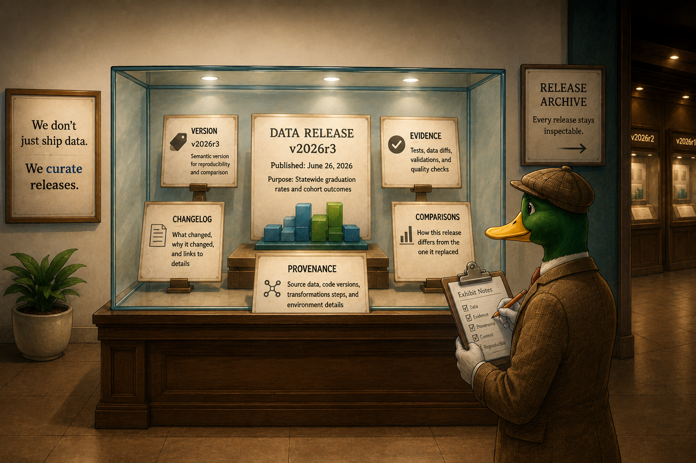
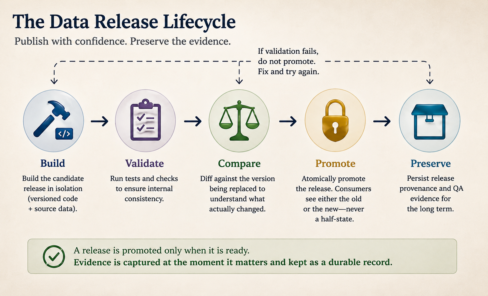
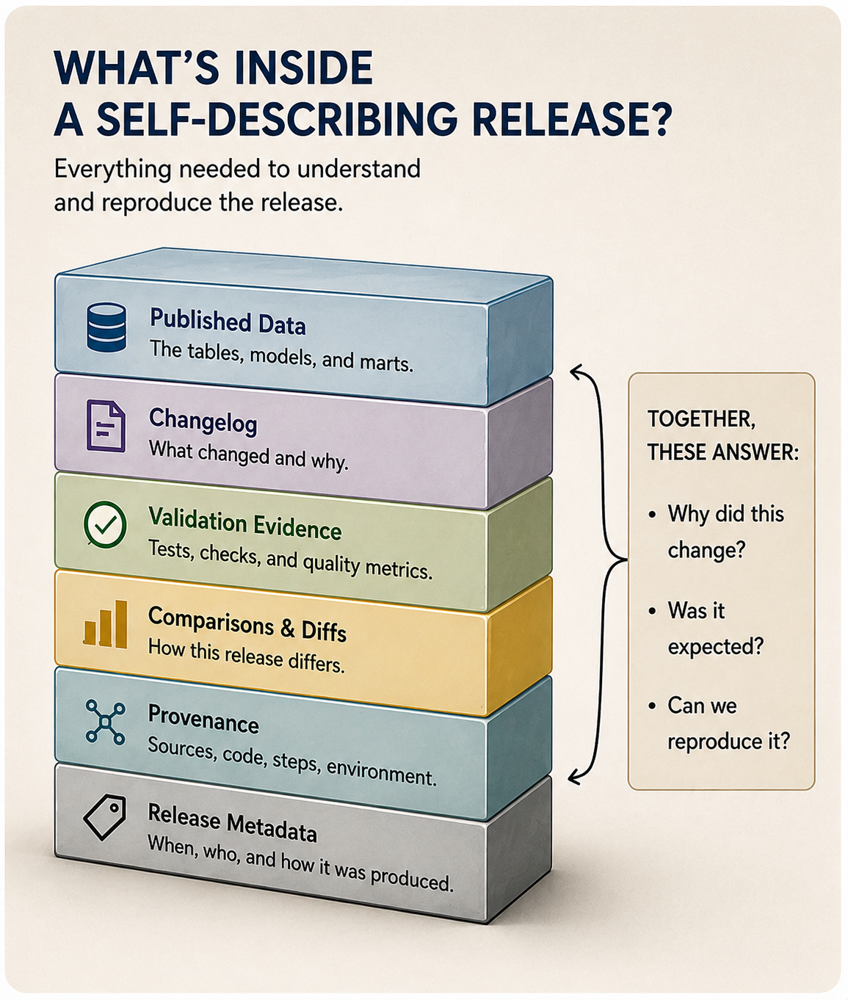
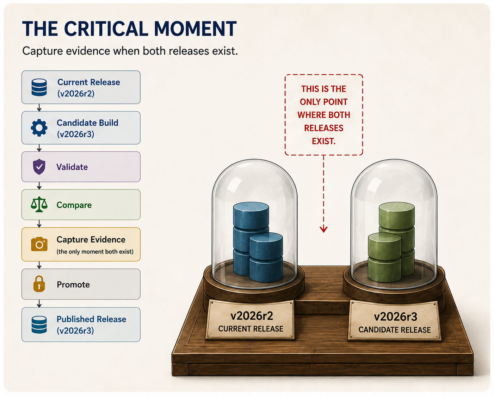
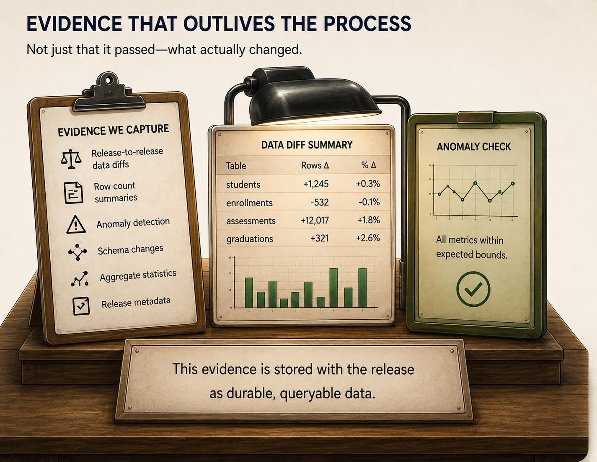
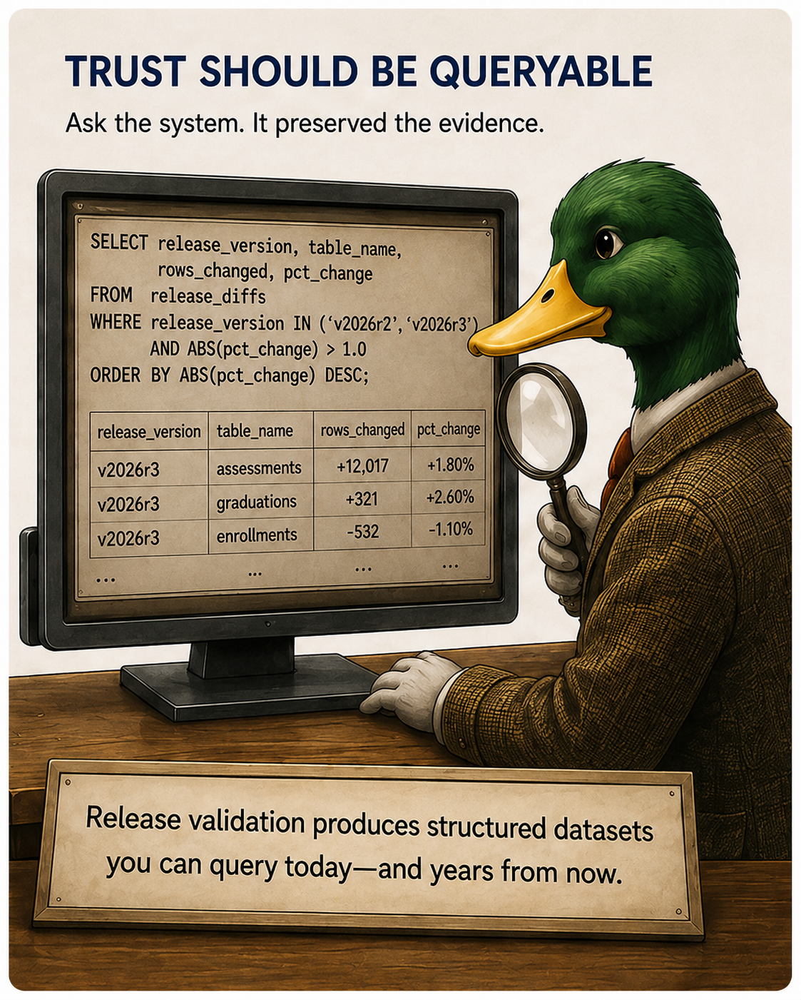
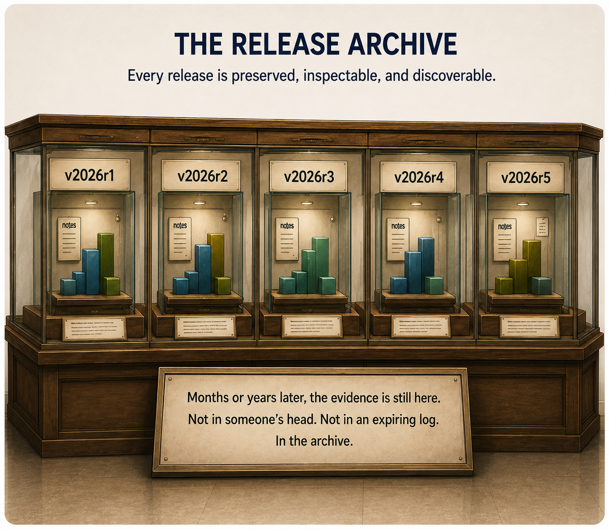

{width=800px fig-align="center"}

When I wrote about [Data Science in a Box](/posts/data-science-in-a-box/index.qmd), the central idea was that modern analytics doesn't require a sprawling collection of managed services. A surprisingly capable analytics platform can be built from a relatively small set of tools that emphasize code, reproducibility, and version control.

One criticism of that philosophy is understandable.

> Does putting everything into one box simply create a bigger black box?

I'd argue it's the opposite. The more responsibility a platform takes on, the more transparent it should become. A mature analytics platform shouldn't just produce datasets. It should produce evidence. Every release should explain where it came from, what changed, and why it deserves to be trusted.

That has led me to think about trust a little differently. Rather than treating trust as a dashboard problem or a data quality problem, I've started thinking of it as a **release engineering problem**.

## Trust is usually treated as an afterthought

Imagine opening a dashboard on Monday morning and noticing that a familiar metric has changed.

The first questions are almost always the same:

- What changed?
- Was the change expected?
- Did the source data change?
- Did the transformation logic change?
- Is this a bug?
- Can I reproduce last week's numbers?

Most analytics platforms don't have particularly good answers.

If you're lucky, there is a pull request describing the code changes. Maybe someone remembers that an upstream provider republished a file. Maybe there's a CI log showing that the pipeline passed.

Those things are useful, but they aren't the same as evidence.

Once the next deployment runs, much of that context evaporates. The warehouse moves forward. Logs age out. The "latest" tables overwrite yesterday's state. Six months later, reconstructing why a release happened often becomes an archaeological excavation.

We tend to think of publishing data as shipping it. The pipeline builds, the tables are updated, and we move on to the next release.

But software releases aren't simply shipped, they're curated. They carry documentation, version history, release notes, and enough context that someone else can understand exactly what changed and why.

I think data releases deserve the same level of care.

Rather than shipping data like sealed crates, we should think about curating releases more like museum exhibits. The data may be the centerpiece, but it's the surrounding context (the changelog and the validation evidence) that allows someone else to understand what they're looking at months or even years later.

That's the kind of transparency I'm after. Transparency into why a release deserves to be trusted.

## Transparency is the feature

Before going further, it's worth saying that this isn't a universal blueprint. If you're processing billions of streaming events or continuously rebuilding operational datasets, the economics are different. There may never be a single "release" worth preserving.

The systems I am building sit at the opposite end of that spectrum. They ingest periodic updates from public agencies, produce curated analytical datasets, and then remain stable until the next release. In that environment, preserving the context around a release is often just as valuable as preserving the data itself.

{width=800px fig-align="center"}

A black box asks consumers to trust its outputs. A glass box lets them inspect them. A transparent system produces enough evidence that trust becomes a consequence rather than a requirement.

That's a key distinction.

Transparency isn't about exposing every SQL statement or expecting analysts to inspect execution plans. It means that every published release carries enough context to answer questions like:

- What changed compared to the previous release?
- Were those changes expected?
- What evidence supported promoting this release?
- Can this release be reproduced?
- Can I inspect the reasoning months later?

Those aren't operational questions. They're **release engineering** questions.

## A release is more than a collection of tables

{width=600px fig-align="center"}

Thinking in terms of releases changes the shape of the system. A release is no longer just the current contents of a warehouse. It becomes an artifact with its own identity.

Like a museum exhibit, the data itself is only part of the story. The labels, the historical context, and the documentation are what make the exhibit meaningful.

A data release should work the same way. The tables in the dataset are only part of the release. Equally important is the information that explains those tables: what changed, how they were produced, why they were considered safe to publish, and whether they can be reproduced in the future.

That package of contextual information is what I'll call **release provenance**.

For a data release, provenance isn't just an audit log or a lineage graph. It's the collection of evidence that allows someone months or even years later to understand (and if necessary, reproduce) the release.

That might include:

- a version identifier
- a changelog describing what changed
- validation evidence collected before promotion
- comparisons to the release being replaced
- the version of the transformation code used to build the release
- the versioned source data that fed the pipeline
- enough metadata to rerun the same comparisons and verify the results

Together, these artifacts answer questions that inevitably arise after publication.

> Why did this number change?

> Was this an upstream correction or a transformation change?

> Can we reproduce exactly what we published last year?

Without release provenance, those questions often become an exercise in digging through Git history, CI logs, and institutional memory. You are reliant on people remembering what happened, rather than the system preserving the evidence. With it, every release becomes self-describing.

## The first principle: build, then promote

{width=800px fig-align="center"}

One consequence of this way of thinking is that consumers should never observe a warehouse in a partially updated state. A release should be built somewhere isolated. It should be validated completely. Only then should it replace the current production release in a single atomic promotion.

If validation fails, nothing changes. Consumers continue using the previous release.

The important point isn't blue/green deployment itself. It's the principle that publication is separate from construction.

That separation creates a natural place to ask an important question: _"Is this release ready?"_

## Evidence should outlive the release process

{width=800px fig-align="center"}

Passing automated tests is necessary, but it isn't sufficient. Tests answer whether a candidate release is internally consistent. They don't explain how it differs from the version currently in production.

That comparison only exists briefly. Just before promotion, both the current release and the candidate release coexist. That's the moment to capture evidence. Not merely that validation succeeded, but what actually changed.

For me, that evidence includes things like:

- release-to-release data diffs
- row count summaries
- anomaly detection
- schema changes
- aggregate statistics
- release metadata

Unlike CI artifacts, these artifacts aren't ephemeral. Storing test outputs or data diffs in a CI log for 90 days is fine for incremental changes, but it doesn't preserve the context needed to understand a release months later. That evidence needs to be durable, queryable records.

Months later, they can still answer:

> What changed between version v2026r3 and the version it replaced?

## Trust should be queryable

{width=600px fig-align="center"}

One thing I didn't expect was that QA itself could become data. Instead of producing HTML reports or transient CI comments, release validation can produce structured datasets. Those datasets become their own historical record.

Instead of asking people to remember why a release happened, you can ask the system, because it preserved the evidence.

## A framework, not a finished methodology

I don't think this framework is complete. There are some real trade-offs.

- How much evidence is worth keeping forever?
- When should validation be exact versus tolerant?
- How much review should still remain human?
- What constitutes a release?

I'm still working through those questions, but the direction feels increasingly clear.

The more I think about the purpose of analytics, the less convinced I am that trust is something dashboards earn after publication. Trust is something the release process should engineer into every published artifact.

That might be the most important idea I've had since codifying [Data Science in a Box](/posts/data-science-in-a-box/index.qmd).

**Curation is about more than simply preserving artifacts. _It preserves the context needed to understand them_**.

{width=800px fig-align="center"}

Curating releases isn't about expecting trust, it's about keeping the receipts. Preserving the evidence earns that trust and enables continual improvement, making sure that every release is self-describing, reproducible, and understandable long after the fact.

No more guesswork and apologies. Just an auditable trail of evidence that ensures explainability. That's what turns a black box into a glass box. And that's what makes trust a release engineering problem.
