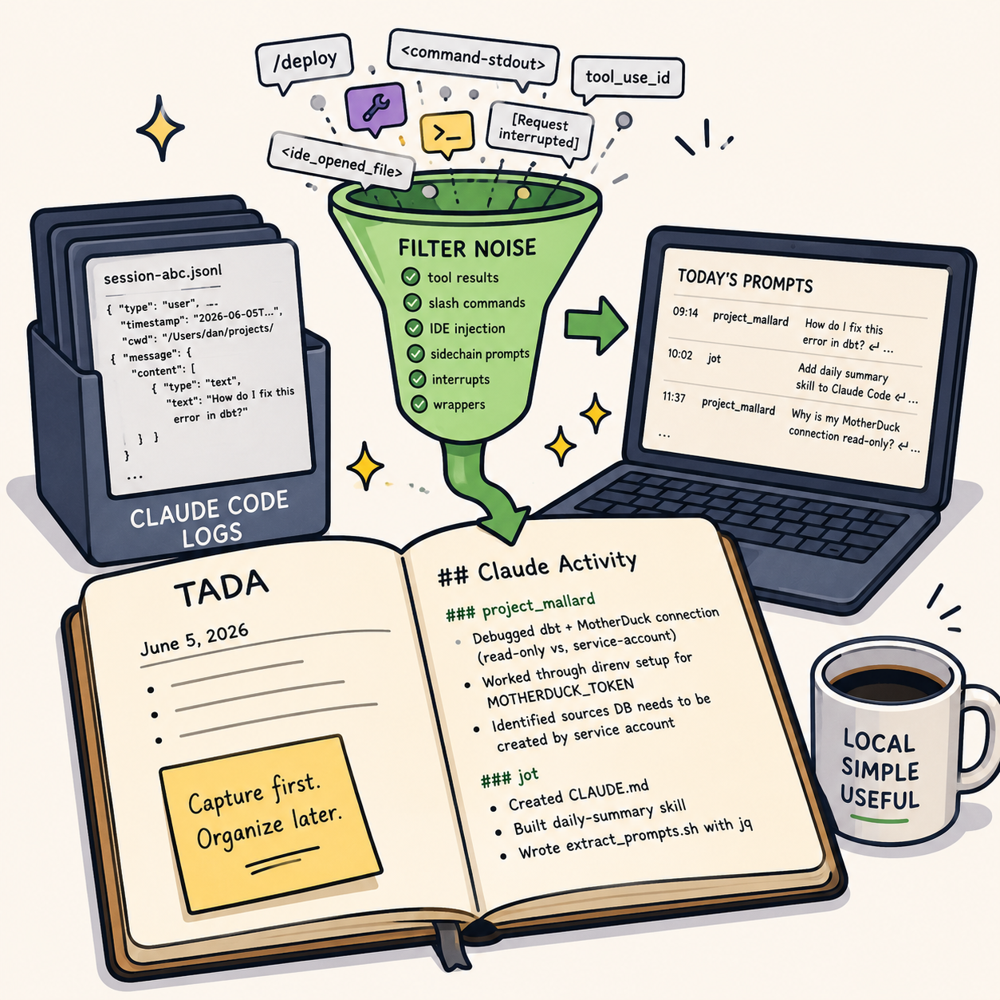

{width=450px fig-align="center"}

A while back I wrote about my lightweight note-taking workflow built around [Ta-Da Lists and Jot](/posts/tada-and-jot/index.qmd).

The basic idea was simple: 

> capture first, organize later.

That workflow still works well for human-written notes. But over the last few months I noticed something else accumulating alongside it: Claude Code sessions.

Not the outputs. The prompts.

A day of working with an agent leaves behind a surprisingly accurate record of intent. What I was trying to do, what I got stuck on, what I abandoned, and what eventually worked. The problem is that this record is effectively invisible. The logs exist, but they’re not readable in any meaningful way.

So I started treating prompts as a first-class work log and built a small system to extract them from local Claude Code sessions and compress them into the same daily notes I already use.

At the end of the day, I get something like this:

```markdown
## Claude Activity

### current project
- Debugged MotherDuck connection issue related to shared databases and service-account 
ownership
- Worked through `direnv` setup for `MOTHERDUCK_TOKEN`
- Refined dbt configuration for writable vs read-only environments

### jot
- Built a Claude Code `daily-summary` skill
- Created a prompt extraction script using `jq`
- Experimented with automatic work journaling from local agent logs
```

Importantly, this is synthesis rather than archival. I do not want raw transcripts in my notes.

The value comes from compressing a day's worth of fragmented prompts into a small number of coherent themes.

## The Workflow

The system that produces this is intentionally simple:

```{mermaid}
flowchart LR
    A[Claude Code JSONL Logs] --> B[extract_prompts.sh]
    B --> C[Filter Noise]
    C --> D[Group by Project]
    D --> E[LLM Synthesis]
    E --> F[TADA.md]
```

The interesting part is not the summarization. It's the filtering.

Claude's local logs contain a lot of machine-oriented context that is technically useful but noisy:

* tool calls
* slash commands
* IDE injection
* command wrappers
* sidechain prompts
* interrupted requests

The extractor removes all of that before the model ever sees the data.

What remains is a clean stream of user intent.

## Why this is useful

Programming with agents creates a new kind of metadata exhaust.

We already have commit messages for code. This is closer to commit messages for thought.

Prompts capture things that never make it into git history:

* debugging paths that went nowhere
* architectural decisions considered and rejected
* small research detours
* setup friction that disappears once solved

The raw logs are too noisy to use directly, but they contain high-fidelity signals about what you were actually working on.

This system turns that into something reviewable.

## The Skill

The extraction and summarization is implemented as a narrow Claude Code skill that runs locally.

::: {.callout-tip collapse="true"}

## `.claude/skills/daily-summary/SKILL.md`

````markdown
---
name: daily-summary
description: Use this skill when the user asks for a daily summary of their Claude Code 
activity (today's prompts across all projects on this machine) to be written to their 
jot daily notes file. Reads ~/.claude/projects/*/*.jsonl, groups prompts by project, 
synthesizes a per-project summary, and appends it to today's TADA.md in the jot repo 
(creating the file via the `jot` shell function if it doesn't exist).
---

# Daily Claude Activity Summary

Append a per-project summary of today's Claude Code prompts to today's TADA note 
in `~/projects/jot/<YYYY>/`.

## Steps

### 1. Compute today's note path

Match the `jot` shell function in `README.md` exactly:

```bash
year=$(date +%Y)
ymd=$(date +%Y%m%d)
dow=$(date +%a | sed 's/Mon/M/;s/Tue/T/;s/Wed/W/;s/Thu/Th/;s/Fri/F/;s/Sat/Sa/;s/Sun/Su/')
note="${HOME}/projects/jot/${year}/${ymd}_${dow}_TADA.md"
```

### 2. Create the note if missing — via the `jot` function

The `jot` function lives in the user's shell profile, so invoke it in an interactive shell. 
Use whichever shell is configured (zsh on macOS by default):

```bash
if [[ ! -f "$note" ]]; then
  zsh -ic 'jot' >/dev/null 2>&1 || bash -ic 'jot' >/dev/null 2>&1 || true
fi
```

If `$note` still doesn't exist after that (jot unavailable for some reason), fall back to 
creating it inline with the same header `jot` writes:

```bash
if [[ ! -f "$note" ]]; then
  mkdir -p "$(dirname "$note")"
  date_long=$(date +"%B %d, %Y")
  echo "# TADA Daily Log - ${date_long}" > "$note"
fi
```

### 3. Extract today's prompts

Run the helper that ships with this skill:

```bash
bash "$CLAUDE_PROJECT_DIR/.claude/skills/daily-summary/extract_prompts.sh"
```

(If `$CLAUDE_PROJECT_DIR` isn't set, use 
`~/projects/jot/.claude/skills/daily-summary/extract_prompts.sh`.)

It emits TSV lines: `ISO-timestamp \t project-cwd \t prompt-text` for today only, with tool 
results, sidechain prompts, slash-command invocations, interrupt markers, and IDE-injection 
wrappers already filtered out. Multi-line prompts have newlines collapsed to `⏎`.

If the script emits nothing, tell the user there were no Claude prompts today and stop — do 
not write an empty section.

### 4. Synthesize the summary

Read the extracted prompts and write a per-project summary using your own judgment. Group by 
the project directory (the basename of the cwd column — e.g. 
`~/projects/<repo_name>` → `<repo_name>`). Within each group, write 2–5 bullet points 
describing what the user was actually working on — themes, problems hit, decisions made — 
not a verbatim transcript. Skip projects with only one trivial prompt unless that prompt 
itself is substantive.

Style guide: terse, past-tense, match the existing TADA notes in `~/projects/jot/2026/`. 
Example file: short bullet list, no fluff.

### 5. Append (or replace) the summary section in the note

Add a section titled `## Claude Activity` at the end of the note. If a `## Claude Activity` 
section already exists from an earlier run today, replace its body — don't stack duplicates. 

Format:

```markdown
## Claude Activity

### current project
- Debugged MotherDuck connection: read-only share vs. writable service-account database 
conflict in dbt `profiles.yml`
- Worked through direnv setup for `MOTHERDUCK_TOKEN`
- Identified that the shared sources DB needs to be created by the service account, not 
via browser auth

### jot
- Created CLAUDE.md
- Built this `daily-summary` skill
```

Use the Edit tool to do the replace-or-append; do not rewrite the whole file.

### 6. Report what you did

One sentence: which note was updated, how many projects, how many prompts summarized. Don't 
paste the summary back at the user — they can open the file.

## Notes

- This skill reads only the user's own logs under `~/.claude/projects/`; nothing leaves the 
machine.
- The extractor uses `jq`. If `jq` is missing, install it (`brew install jq`) before retrying.
- The default date is "today" (local time). To regenerate a past day's summary, pass a 
`YYYY-MM-DD` arg to `extract_prompts.sh`.
````

:::

## The Extractor

The extraction step is where most of the real work happens.

Claude Code stores session history as JSONL under `~/.claude/projects`. These logs include a lot more than just prompts. They are too noisy to use directly.

The goal of the extractor is to reduce it all down to just the prompts for the day so the summarization step can focus on the user's actual work.

::: {.callout-tip collapse="true"}

## `.claude/skills/daily-summary/extract_prompts.sh`

```bash
#!/usr/bin/env bash
# Extract today's real user prompts from every Claude Code session log on this
# machine and emit a TSV stream of: ISO-timestamp \t project-cwd \t prompt-text
#
# Filters out: tool results, sidechain (subagent) prompts, meta entries,
# slash-command invocations, command-stdout wrappers, interrupt markers, and
# IDE-injected <ide_opened_file>/<ide_selection> blocks (these are stripped
# from the prompt so the user's actual question remains).
#
# Optional arg overrides the date (YYYY-MM-DD); defaults to today (local time).

set -euo pipefail

day="${1:-$(date +%Y-%m-%d)}"
logs_dir="${HOME}/.claude/projects"

if ! command -v jq >/dev/null 2>&1; then
  echo "jq is required but not installed" >&2
  exit 1
fi

mapfile -t files < <(find "$logs_dir" -name '*.jsonl' -type f -newermt "$day" 2>/dev/null)

if [[ ${#files[@]} -eq 0 ]]; then
  exit 0
fi

jq -r --arg day "$day" '
  select(.type == "user")
  | select((.isMeta // false) | not)
  | select((.isSidechain // false) | not)
  | select(.timestamp != null and (.timestamp | startswith($day)))

  # Normalize message.content: it can be a string OR an array of parts.
  | (.message.content) as $raw
  | (
      if ($raw | type) == "string" then [{"type":"text","text":$raw}]
      elif ($raw | type) == "array" then $raw
      else [] end
    ) as $content

  # Drop tool-result events (they carry tool_use_id on a content part).
  | select([ $content[] | objects | has("tool_use_id") ] | any | not)

  # Join all text parts.
  | ([ $content[] | objects | select(.type == "text") | .text ] | join("\n")) as $raw_text

  # Strip IDE injection wrappers so the actual question remains.
  | ($raw_text
      | gsub("<ide_opened_file>[\\s\\S]*?</ide_opened_file>"; ""; "s")
      | gsub("<ide_selection>[\\s\\S]*?</ide_selection>"; ""; "s")
      | gsub("<system-reminder>[\\s\\S]*?</system-reminder>"; ""; "s")
      | gsub("^\\s+|\\s+$"; "")
    ) as $text

  | select($text != "")
  | select($text != "[Request interrupted by user]")
  | select(($text | test("^<command-(name|message|stdout)>"; "s")) | not)
  | select(($text | test("^<local-command-stdout>"; "s")) | not)
  | select(($text | startswith("/")) | not)

  | [.timestamp, (.cwd // "unknown"), ($text | gsub("\t"; " ") | gsub("\n"; " ⏎ "))]
  | @tsv
' "${files[@]}" | sort -u
```

:::

What remains is surprisingly valuable: a chronological stream of intent.

## Closing Thoughts

This system is intentionally boring. 

It’s just shell scripts, markdown files, and a narrowly scoped agent skill.

Nothing fancy. No new tools. No complex orchestration. No external dependencies beyond `jq` (which is widely available and easy to install). Just a lightweight reflective layer over work that was already happening.

It turns out that when you compress enough agent interaction down to “what was I trying to do today?”, a useful pattern emerges: prompts start to look like commit messages for thought.
